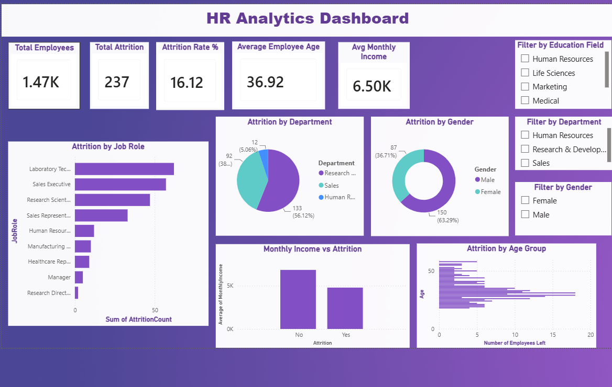

# HR Analytics Dashboard | Power BI

Built an interactive HR analytics dashboard analyzing employee attrition 
patterns across 1,470 employee records using Power BI.

## 📊 Dashboard Preview

## Key Insights
- Identified department, job role, and salary as key attrition drivers
- Sales department shows highest attrition rate
- Lower monthly income correlates with higher attrition
- Built using KPI cards, pie charts, bar charts, and dynamic slicers

## Tools Used
Power BI Desktop, DAX Measures, Data Modeling

## Dashboard Features
- 5 KPI Cards (Total Employees, Attrition, Attrition Rate, Avg Age, Avg Income)
- 5 Interactive Charts (Department, Job Role, Gender, Salary, Age)
- 3 Slicers (Department, Gender, Education Field)
